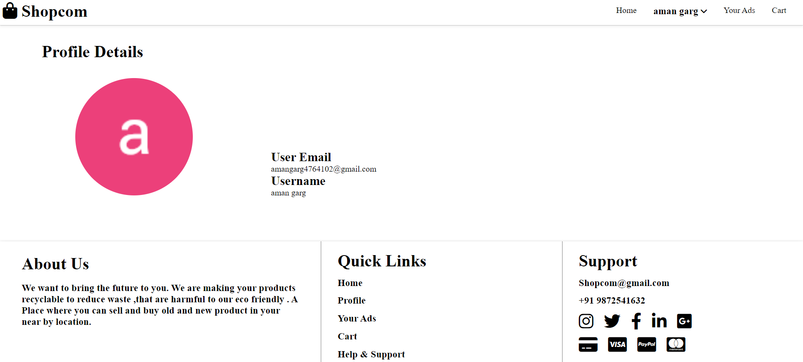

# Quiz Platform
* make a ONLINE SELL / BUY Product using node js

# How To Run
* Install Node.js(nodejs.org).
* Clone, Fork or donwload the repositry from the terminal.
* Open in VS Code or Atom.
* Run Command npm install.
* Run Redis server By writting command(redis-server)
* Run Command npm start
* Open in your browser and go to (https://localhost:8000)
* I already deployed it at heroku (https://shopcom24.herokuapp.com/)

# Features
* Adding your Account with GOOGLE AUTHENTICATION.
* Deleting or Modify or create the Product.

# Screenshots

* Login page

* Register page

* USER account detail

*  USER Cart

* All Product

* User Selling product details
